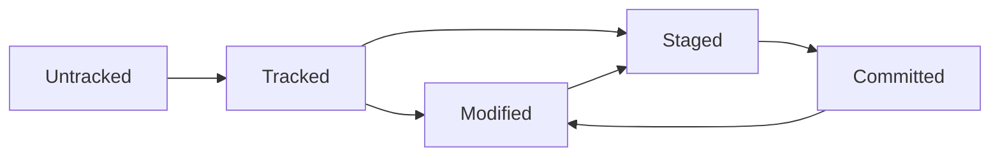

# Fondamentaux de Git

## Support de cours - BTS SIO 1ère année

---

## 🎯 Objectifs pédagogiques

À la fin de ce cours, vous serez capables de :

- Comprendre les concepts fondamentaux du versioning
- Installer et configurer Git sur votre poste de travail
- Créer et gérer un dépôt Git local
- Effectuer les opérations de base (add, commit, push, pull)
- Travailler avec les branches
- Collaborer sur des projets avec d'autres développeurs

---

## 1. Introduction au versioning

### 🤔 Réflexion initiale

Avant de commencer, réfléchissez à ces questions :

- Comment gérez-vous actuellement vos fichiers de projets informatiques ?
- Que faites-vous quand vous voulez garder plusieurs versions d'un même fichier ?
- Comment travaillez-vous en équipe sur un même projet ?

### Le problème sans versioning

Imaginez ce scénario familier :

```
MonProjet/
├── index.html
├── index_v2.html
├── index_final.html
├── index_final_vraiment.html
├── index_final_version_prof.html
└── index_CETTE_FOIS_CEST_LA_BONNE.html
```

**Les problèmes :**

- Confusion sur la "vraie" version actuelle
- Perte d'historique des modifications
- Difficile collaboration en équipe
- Risque de perte de données
- Pas de traçabilité des changements

### 🎯 Question de réflexion

Quels autres problèmes voyez-vous avec cette méthode ?

---

## 2. Qu'est-ce que Git ?

### Définition

**Git** est un système de contrôle de version distribué (DVCS - Distributed Version Control System) créé par Linus Torvalds en 2005.

### Analogie : Git comme une "machine à remonter le temps"

Imaginez Git comme :

- Un **appareil photo** qui prend des "instantanés" (snapshots) de votre projet
- Une **machine à remonter le temps** qui vous permet de revenir à n'importe quel moment
- Un **carnet de bord** qui enregistre qui a fait quoi et quand

### Les avantages de Git

- **Historique complet** : chaque modification est enregistrée
- **Collaboration facilitée** : plusieurs personnes peuvent travailler simultanément
- **Branches** : travail en parallèle sur différentes fonctionnalités
- **Sécurité** : système distribué = pas de point de défaillance unique
- **Performance** : opérations rapides même sur de gros projets

### Git vs autres systèmes

| Aspect          | Sans versioning | Git            |
| --------------- | --------------- | -------------- |
| Historique      | ❌ Perdu         | ✅ Complet      |
| Collaboration   | ❌ Difficile     | ✅ Naturelle    |
| Sauvegardes     | ❌ Manuelles     | ✅ Automatiques |
| Expérimentation | ❌ Risquée       | ✅ Sécurisée    |

---

## 3. Installation et configuration

### Installation

#### Windows

1. Télécharger depuis [git-scm.com](https://git-scm.com/)
2. Exécuter l'installeur
3. Garder les options par défaut (recommandé pour débutants)

#### macOS

```bash
# Avec Homebrew
brew install git

# Ou télécharger depuis git-scm.com
```

#### Linux (Ubuntu/Debian)

```bash
sudo apt update
sudo apt install git
```

### Vérification de l'installation

```bash
git --version
# Devrait afficher : git version 2.x.x
```

### Configuration initiale

**⚠️ Important :** À faire une seule fois après installation

```bash
# Configuration globale (pour tous vos projets)
git config --global user.name "Votre Nom"
git config --global user.email "votre.email@example.com"

# Configuration optionnelle mais recommandée
git config --global init.defaultBranch main
git config --global core.editor "code --wait"  # Si vous utilisez VS Code
```

### Vérifier la configuration

```bash
git config --list
# ou pour voir une config spécifique :
git config user.name
```

---

## 4. Concepts fondamentaux

### Les trois zones de Git

```
Zone de travail     Zone d'index        Dépôt Git
(Working Directory) (Staging Area)      (Repository)
      |                   |                 |
  Vos fichiers       Préparation        Historique
   modifiés          des commits         permanent
      |                   |                 |
      |-- git add ------->|                 |
      |                   |-- git commit -->|
```

#### 1. **Zone de travail** (Working Directory)

- Vos fichiers actuels sur le disque dur
- Là où vous éditez et modifiez vos fichiers

#### 2. **Zone d'index** (Staging Area)

- Zone intermédiaire où vous préparez vos modifications
- Permet de sélectionner quels changements inclure dans le prochain commit

#### 3. **Dépôt Git** (Repository)

- Base de données contenant l'historique complet
- Stocke tous les commits (instantanés) du projet

### 🎯 Question de compréhension

_Pourquoi avoir une zone intermédiaire (staging) ? Ne pourrait-on pas passer directement de la zone de travail au dépôt ?_

### Les états des fichiers



- **Untracked** : fichier non suivi par Git
- **Tracked** : fichier connu de Git
- **Modified** : fichier modifié depuis le dernier commit
- **Staged** : modifications prêtes à être commitées
- **Committed** : modifications sauvegardées dans l'historique

---

## 5. Commandes essentielles

### Initialiser un dépôt Git

```bash
# Dans le dossier de votre projet
git init
```

**Résultat :** Crée un dossier `.git` caché contenant la base de données Git

### Voir l'état actuel

```bash
git status
```

**À retenir :** Utilisez cette commande **très souvent** !

### Ajouter des fichiers à la zone d'index

```bash
# Ajouter un fichier spécifique
git add index.html

# Ajouter plusieurs fichiers
git add index.html style.css

# Ajouter tous les fichiers modifiés
git add .
```

### Créer un commit (instantané)

```bash
git commit -m "Message décrivant les modifications"
```

**Exemple de bons messages de commit :**

```bash
git commit -m "Ajout de la page d'accueil"
git commit -m "Correction du bug de connexion"
git commit -m "Mise à jour du style CSS pour mobile"
```

### Voir l'historique

```bash
# Historique détaillé
git log

# Historique condensé
git log --oneline

# Historique graphique
git log --graph --oneline
```

### Voir les différences

```bash
# Différences dans la zone de travail
git diff

# Différences entre staged et dernier commit
git diff --staged
```

---

## 6. Le workflow Git de base

### Cycle de travail typique

```
1. Modifier des fichiers
        ↓
2. Vérifier les changements (git status, git diff)
        ↓
3. Ajouter à l'index (git add)
        ↓
4. Créer un commit (git commit)
        ↓
5. Répéter
```

### Exemple pratique : Création d'une page web

```bash
# 1. Initialiser le projet
mkdir mon-site-web
cd mon-site-web
git init

# 2. Créer le premier fichier
echo "<h1>Mon site web</h1>" > index.html

# 3. Vérifier l'état
git status
# Réponse : index.html est "untracked"

# 4. Ajouter le fichier
git add index.html

# 5. Vérifier à nouveau
git status
# Réponse : index.html est "staged"

# 6. Créer le premier commit
git commit -m "Ajout de la page d'accueil"

# 7. Vérifier l'historique
git log --oneline
```

### ⚡ Exercice guidé

**À vous de jouer !**

1. Créez un nouveau dossier `mon-premier-projet`
2. Initialisez un dépôt Git
3. Créez un fichier `README.md` avec votre nom
4. Ajoutez et committez ce fichier
5. Modifiez le fichier en ajoutant votre formation
6. Créez un nouveau commit avec ces modifications

---

## 7. Travailler avec les branches

### Qu'est-ce qu'une branche ?

**Analogie :** Imaginez l'historique Git comme un arbre :

- Le **tronc** = branche principale (`main` ou `master`)
- Les **branches** = développement parallèle de fonctionnalités
- Les **feuilles** = commits individuels

### Pourquoi utiliser les branches ?

```
main:     A---B---C---F---G
               \         /
feature:        D---E---/
```

**Avantages :**

- Développement parallèle sans conflits
- Expérimentation sécurisée
- Isolation des fonctionnalités
- Collaboration facilitée

### Commandes de base pour les branches

```bash
# Voir toutes les branches
git branch

# Créer une nouvelle branche
git branch nom-de-branche

# Changer de branche
git checkout nom-de-branche

# Créer ET changer de branche (raccourci)
git checkout -b nom-de-branche

# Fusionner une branche dans la branche courante
git merge nom-de-branche

# Supprimer une branche
git branch -d nom-de-branche
```

### Exemple pratique : Développement d'une fonctionnalité

```bash
# Partir de la branche main
git checkout main

# Créer une branche pour une nouvelle fonctionnalité
git checkout -b ajout-contact

# Travailler sur la fonctionnalité
echo "<p>Contactez-nous : email@exemple.com</p>" > contact.html
git add contact.html
git commit -m "Ajout de la page de contact"

# Retourner sur main
git checkout main

# Fusionner la fonctionnalité
git merge ajout-contact

# Nettoyer : supprimer la branche
git branch -d ajout-contact
```

### 🎯 Question de réflexion

_Dans quelles situations est-il recommandé de créer une nouvelle branche plutôt que de travailler directement sur `main` ?_

---

## 8. Collaboration et dépôts distants

### Concepts des dépôts distants

**Local vs Distant :**

- **Dépôt local** : sur votre ordinateur
- **Dépôt distant** : sur un serveur (GitHub, GitLab, etc.)

### GitHub : Plateforme de collaboration

**GitHub** est une plateforme web qui héberge des dépôts Git et offre des outils de collaboration.

### Commandes pour les dépôts distants

```bash
# Cloner un dépôt existant
git clone https://github.com/utilisateur/projet.git

# Ajouter un dépôt distant
git remote add origin https://github.com/utilisateur/projet.git

# Voir les dépôts distants
git remote -v

# Envoyer vos commits vers le dépôt distant
git push origin main

# Récupérer les dernières modifications
git pull origin main
```

### Workflow de collaboration

```
1. Cloner le dépôt
        ↓
2. Créer une branche pour votre travail
        ↓
3. Développer et committer localement
        ↓
4. Pousser votre branche vers le serveur
        ↓
5. Créer une Pull Request (demande de fusion)
        ↓
6. Code review et fusion par l'équipe
```

### Gestion des conflits

**Qu'est-ce qu'un conflit ?** Quand deux personnes modifient la même ligne du même fichier.

**Exemple de conflit :**

```html
<<<<<<< HEAD
<h1>Mon Super Site</h1>
=======
<h1>Notre Fantastique Site</h1>
>>>>>>> feature-branch
```

**Résolution :**

1. Ouvrir le fichier en conflit
2. Choisir quelle version garder (ou mélanger)
3. Supprimer les marqueurs de conflit (`<<<<<<<`, `=======`, `>>>>>>>`)
4. Ajouter et committer la résolution

---

## 9. Exercices pratiques

### 🏋️ Exercice 1 : Premier projet Git

**Objectif :** Créer et gérer un petit projet web

**Instructions :**

1. Créez un dossier `portfolio-web`
2. Initialisez un dépôt Git
3. Créez les fichiers suivants :
    - `index.html` : page d'accueil avec votre nom
    - `style.css` : quelques styles de base
    - `README.md` : description du projet
4. Créez des commits séparés pour chaque fichier
5. Modifiez `index.html` pour ajouter une section "À propos"
6. Committez cette modification

**Questions de vérification :**

- Combien de commits avez-vous créés ?
- Que montre `git log --oneline` ?
- Quelle est la différence entre `git status` avant et après chaque `git add` ?

### 🏋️ Exercice 2 : Travailler avec les branches

**Objectif :** Développer une fonctionnalité sur une branche séparée

**Instructions :**

1. À partir de votre projet précédent, créez une branche `ajout-portfolio`
2. Sur cette branche, créez un fichier `projets.html` listant 3 projets fictifs
3. Committez ce fichier
4. Retournez sur `main` et créez une branche `ajout-style`
5. Sur cette branche, modifiez `style.css` pour améliorer le design
6. Committez ces modifications
7. Fusionnez les deux branches dans `main`

**Questions de défi :**

- Comment visualiser l'arbre des branches ?
- Que se passe-t-il si vous oubliez de committer avant de changer de branche ?

### 🏋️ Exercice 3 : Simulation de collaboration

**Objectif :** Simuler le travail en équipe

**Instructions :**

1. Créez un compte GitHub (si pas déjà fait)
2. Créez un nouveau dépôt sur GitHub appelé `projet-equipe`
3. Clonez ce dépôt localement
4. Créez un fichier `equipe.md` avec les noms de 3 membres d'équipe fictifs
5. Poussez ce fichier vers GitHub
6. Simulez un conflit :
    - Modifiez `equipe.md` directement sur GitHub
    - Modifiez aussi `equipe.md` localement (même ligne)
    - Essayez de pousser vos modifications
7. Résolvez le conflit et finalisez la synchronisation

### 🎯 Questions d'approfondissement

Après les exercices, réfléchissez à ces questions :

1. **Workflow :** Décrivez le workflow que vous utiliseriez pour développer une nouvelle fonctionnalité en équipe.

2. **Bonnes pratiques :** Quels sont selon vous les éléments d'un bon message de commit ?

3. **Résolution de problèmes :** Comment feriez-vous pour revenir en arrière si vous avez fait une erreur dans un commit ?

4. **Organisation :** Comment organiseriez-vous les branches pour un projet avec plusieurs développeurs ?


---

## 📚 Ressources complémentaires

### Documentation officielle

- [Documentation Git](https://git-scm.com/doc)
- [Tutoriel interactif Git](https://learngitbranching.js.org/)

### Outils graphiques

- **VS Code** : intégration Git native
- **GitKraken** : interface graphique élégante
- **Sourcetree** : outil gratuit d'Atlassian

### Commandes de référence rapide

```bash
# Configuration
git config --global user.name "Nom"
git config --global user.email "email"

# Dépôt local
git init                    # Initialiser
git status                  # État actuel
git add fichier            # Ajouter à l'index
git add .                  # Ajouter tout
git commit -m "message"    # Créer un commit
git log                    # Historique

# Branches
git branch                 # Lister les branches
git branch nom             # Créer une branche
git checkout nom           # Changer de branche
git checkout -b nom        # Créer et changer
git merge nom              # Fusionner
git branch -d nom          # Supprimer

# Dépôts distants
git clone url              # Cloner
git remote add origin url  # Ajouter distant
git push origin main       # Pousser
git pull origin main       # Tirer
```
